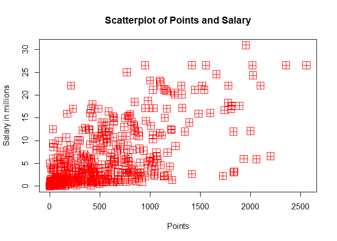
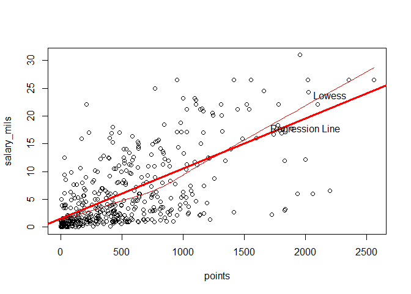
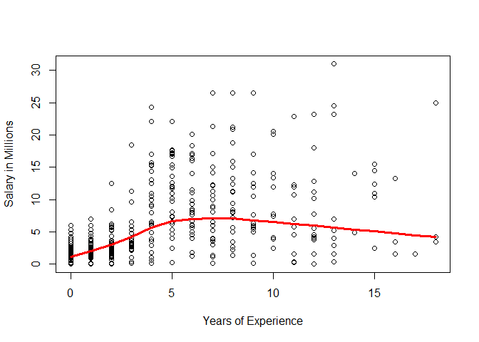
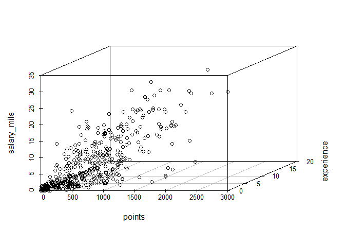
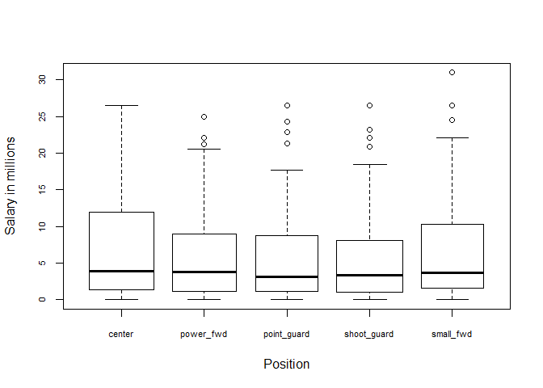

Homework 1
================
Xander Paul

``` r
load("data/nba2017-salary-points.RData")
ls()
```

    ## [1] "experience" "player"     "points"     "points1"    "points2"   
    ## [6] "points3"    "position"   "salary"     "team"

``` r
salary_mils <- salary / 1000000
experience <- replace(experience, experience=="R", 0)
experience <- as.integer(experience)
levels <- c('C', 'PF', 'PG', 'SG', 'SF')
labels <- c('center', 'power_fwd', 'point_guard', 'shoot_guard', 'small_fwd')
pos_fac <- factor(position, levels, labels)
table(pos_fac)
```

    ## pos_fac
    ##      center   power_fwd point_guard shoot_guard   small_fwd 
    ##          89          89          85          95          83

``` r
plot(points, salary_mils, pch = 12, col = 2, cex = 2, xlab = 'Points', ylab = 'Salary in millions', main = 'Scatterplot of Points and Salary')
```



``` r
n <- length(points)
mean_points <- 1 / n * sum(points)
mean_salary <- 1 / n * sum(salary_mils)
var_points <- (1 / (n - 1)) * sum((points - mean_points) ^ 2)
var_salary <- (1 / (n - 1)) * sum((salary_mils - mean_salary) ^ 2)
sd_points <- sqrt(var_points)
sd_salary <- sqrt(var_salary)
cov_points_sal <- (1 / (n - 1)) * sum((points - mean_points) * (salary_mils - mean_salary))
cor_points_sal <- cov_points_sal / (sd_points * sd_salary)
```

``` r
b_one <- cor_points_sal * sd_salary / sd_points
b_zero <- mean_salary - b_one * mean_points
y_hat <- b_zero + b_one * points
summary(y_hat)
```

    ##    Min. 1st Qu.  Median    Mean 3rd Qu.    Max. 
    ##   1.510   2.845   5.206   6.187   8.184  23.398

The regression equation is $\\hat(Y) = 1.51 + 0.009x$. The slope coefficient represents the increase in salary for every additional point. The intercept term represents the base salary for a player who scores no points. If a player scores 0 points, they will get paid 1.51 million dollars. If a player scores 100 points, they will make 2.41 million dollars. If a player scores 500 points, they will make 6.01 million dollars. If a player scores 1000 points, they will make 10.51 million dollars. If a player scores 2000 points, they will make 19.51 million dollars.

``` r
plot(points, salary_mils)
abline(a = 1.51, b = .009, col = 2, lwd = 3)
lines(lowess(x = points, y = salary_mils, f = 2/3), col = 2)
text(c(2000, 2200), c(19.51, 22), labels = c("Regression Line", "Lowess"), pos = c(1, 3))
```



``` r
predicted <- 1.51 + 0.009 * points
residuals <- salary_mils - predicted
rss <- sum((residuals) ^ 2)
tss <- sum((salary_mils - mean_salary) ^ 2)
r_squared <- 1 - (rss / tss)
```

``` r
plot(experience, salary_mils, xlab = "Years of Experience", ylab = "Salary in Millions")
lines(lowess(x = experience, y = salary_mils, f = 2/3), col = 2, lwd = 3)
```



``` r
install.packages('scatterplot3d')
```

    ## Installing package into 'C:/Users/Xander/Documents/R/win-library/3.4'
    ## (as 'lib' is unspecified)

    ## package 'scatterplot3d' successfully unpacked and MD5 sums checked
    ## 
    ## The downloaded binary packages are in
    ##  C:\Users\Xander\AppData\Local\Temp\RtmpAVZ3fu\downloaded_packages

``` r
library(scatterplot3d)
scatterplot3d(points, experience, salary_mils)
```

 On average, there is a positive relation between points, salary, and experience. It is difficult to ascertain experience's true effect on salary from the 3D scatterplot.

``` r
boxplot(salary_mils~pos_fac, varwidth=TRUE, names = c('center', 'power_fwd', 'point_guard', 'shoot_guard', 'small_fwd'), xlab = 'Position', ylab = 'Salary in millions', cex.axis = .7)
```



On average, players in each position make similar amounts of money, with similar interquartile ranges and means. However, every position excepting center has multiple outliers of high salaries.

Most of this homework was fairly easy, but figuring out how to create a boxplot and install a new package was tricky. It was frustrating to knit the file at the end because of installing a new package.
