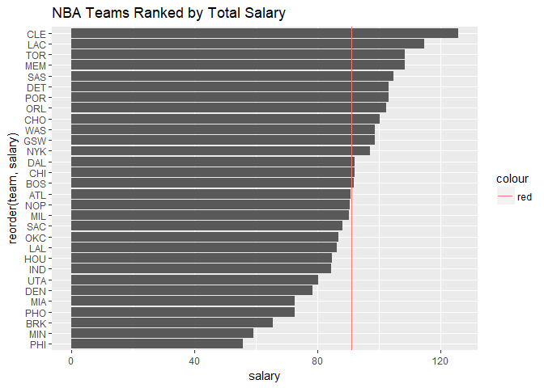
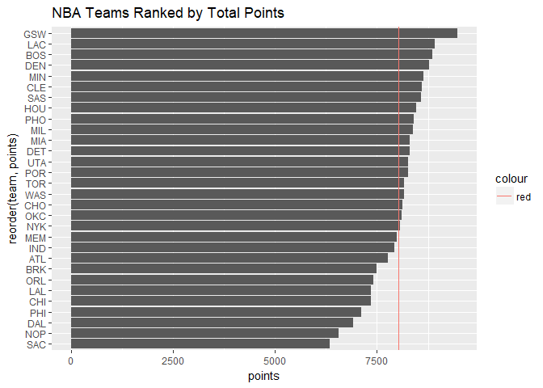
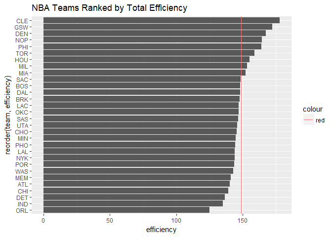
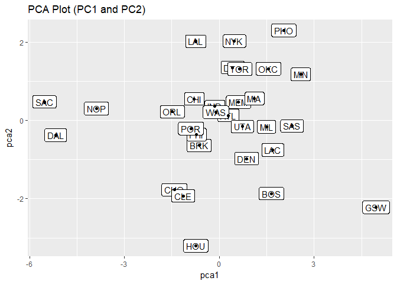
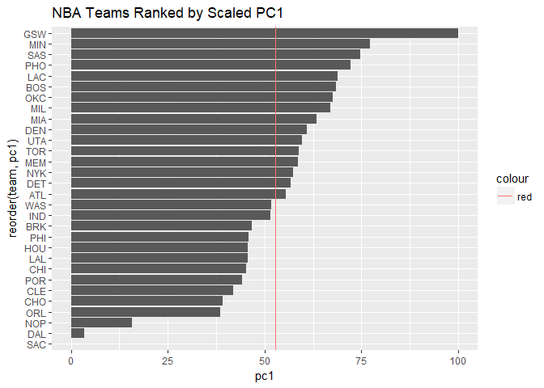

HW 03 - Ranking NBA Teams
================
Xander Paul

``` r
chooseCRANmirror(ind = 50)
require(readr)
```

    ## Loading required package: readr

    ## Warning: package 'readr' was built under R version 3.4.2

``` r
install.packages("readr")
```

    ## Installing package into 'C:/Users/Xander/Documents/R/win-library/3.4'
    ## (as 'lib' is unspecified)

    ## Warning: package 'readr' is in use and will not be installed

``` r
library(readr)
install.packages('ggplot2')
```

    ## Installing package into 'C:/Users/Xander/Documents/R/win-library/3.4'
    ## (as 'lib' is unspecified)

    ## package 'ggplot2' successfully unpacked and MD5 sums checked
    ## 
    ## The downloaded binary packages are in
    ##  C:\Users\Xander\AppData\Local\Temp\Rtmpe4d7hR\downloaded_packages

``` r
library(ggplot2)
```

    ## Warning: package 'ggplot2' was built under R version 3.4.2

``` r
install.packages('dplyr')
```

    ## Installing package into 'C:/Users/Xander/Documents/R/win-library/3.4'
    ## (as 'lib' is unspecified)

    ## package 'dplyr' successfully unpacked and MD5 sums checked
    ## 
    ## The downloaded binary packages are in
    ##  C:\Users\Xander\AppData\Local\Temp\Rtmpe4d7hR\downloaded_packages

``` r
library(dplyr)
```

    ## Warning: package 'dplyr' was built under R version 3.4.2

    ## 
    ## Attaching package: 'dplyr'

    ## The following objects are masked from 'package:stats':
    ## 
    ##     filter, lag

    ## The following objects are masked from 'package:base':
    ## 
    ##     intersect, setdiff, setequal, union

``` r
github <- "https://github.com/ucb-stat133/stat133-fall-2017/raw/master/"
file <- "data/nba2017-roster.csv"
csv <- paste0(github, file)
download.file(url = csv, destfile = 'nba2017-roster.csv')
roster <- read.csv('nba2017-roster.csv')

github <- "https://github.com/ucb-stat133/stat133-fall-2017/raw/master/"
file <- "data/nba2017-stats.csv"
csv <- paste0(github, file)
download.file(url = csv, destfile = 'nba2017-stats.csv')
stats <- read.csv('nba2017-stats.csv')

stats <- mutate(stats, missed_fg = stats$field_goals_atts - stats$field_goals_made)
stats <- mutate(stats, missed_ft = stats$points1_atts - stats$points1_made)
stats <- mutate(stats, points = stats$points1_made + stats$points2_made * 2 + stats$points3_made * 3)
stats <- mutate(stats, rebounds = stats$off_rebounds + stats$def_rebounds)
stats <- mutate(stats, efficiency = (stats$points + stats$rebounds + stats$assists + stats$steals + stats$blocks - stats$missed_fg -stats$missed_ft - stats$turnovers) / stats$games_played)

team <- merge(roster, stats)
teams <- summarise(group_by(team, team),
          experience = sum(experience),
          salary = round((sum(salary) / 1000000), 2),
          points3 = sum(points3_made),
          points2 = sum(points2_made),
          free_throws = sum(points1_made),
          points = sum(points),
          off_rebounds = sum(off_rebounds),
          def_rebounds = sum(def_rebounds),
          assists = sum(assists),
          steals = sum(steals),
          blocks = sum(blocks),
          turnovers = sum(turnovers),
          fouls = sum(fouls),
          efficiency = sum(efficiency))
```

``` r
ggplot(teams, aes(x = reorder(team, salary), y = salary)) + geom_bar(stat='identity') + geom_hline(aes(yintercept = mean(salary), color = 'red')) + coord_flip() + ggtitle("NBA Teams Ranked by Total Salary")
```



``` r
ggplot(teams, aes(x = reorder(team, points), y = points)) + geom_bar(stat='identity') + geom_hline(aes(yintercept = mean(points), color = 'red')) + coord_flip() + ggtitle("NBA Teams Ranked by Total Points")
```



``` r
ggplot(teams, aes(x = reorder(team, efficiency), y = efficiency)) + geom_bar(stat='identity') + geom_hline(aes(yintercept = mean(efficiency), color = 'red')) + coord_flip() + ggtitle("NBA Teams Ranked by Total Efficiency")
```



Cleveland and the Golden State Warriors tend to dominate the rankings.
----------------------------------------------------------------------

``` r
some_teams <- select(teams, points3, points2, free_throws, off_rebounds, def_rebounds, assists, steals, blocks, turnovers, fouls)
pca <- prcomp(some_teams, scale. = TRUE)
pca
```

    ## Standard deviations (1, .., p=10):
    ##  [1] 2.1669994 1.3046111 0.9897094 0.8784756 0.7308134 0.6913872 0.6182263
    ##  [8] 0.5101592 0.3655034 0.2503921
    ## 
    ## Rotation (n x k) = (10 x 10):
    ##                    PC1         PC2         PC3          PC4         PC5
    ## points3      0.1121782 -0.65652993  0.28806873 -0.042637313  0.28657624
    ## points2      0.3601766  0.32892544 -0.06763180 -0.347710703 -0.15173866
    ## free_throws  0.3227564 -0.17651228  0.39157491  0.147596178 -0.21363792
    ## off_rebounds 0.3029366  0.35931603  0.33884845 -0.288483019 -0.16571824
    ## def_rebounds 0.3719432 -0.12808273  0.15026131 -0.492969442  0.26476256
    ## assists      0.3125312 -0.44134618 -0.26294129 -0.088066602 -0.36972525
    ## steals       0.3447256 -0.03540585 -0.48554101  0.177578661 -0.33549491
    ## blocks       0.3162237  0.06131890 -0.48869371  0.003935374  0.65459381
    ## turnovers    0.3353958 -0.02169833  0.08910421  0.532117541 -0.04471763
    ## fouls        0.3072548  0.28954426  0.26469871  0.454751471  0.26814214
    ##                       PC6         PC7         PC8         PC9         PC10
    ## points3      -0.028435666  0.38167878  0.18027569 -0.20631322  0.409762462
    ## points2      -0.088714347  0.07302430 -0.47216199 -0.35836740  0.499011524
    ## free_throws  -0.487342521 -0.62732220  0.07726675 -0.08283563 -0.006875686
    ## off_rebounds  0.283093235  0.13535335  0.64646479 -0.14735551 -0.124601143
    ## def_rebounds  0.066309015 -0.04926346 -0.23787252  0.64632050 -0.168579984
    ## assists       0.176019008  0.11785039 -0.18235775 -0.34086739 -0.547385461
    ## steals       -0.303664534  0.25883825  0.32703573  0.41596580  0.246739300
    ## blocks       -0.009954065 -0.30799231  0.23947533 -0.27071160 -0.057627209
    ## turnovers     0.675777660 -0.18850849 -0.14308362  0.13524769  0.250947823
    ## fouls        -0.298848473  0.47268121 -0.21462859 -0.04367200 -0.335087245

``` r
prop = round((pca$sdev^2), 3) / 10
cumprop = cumsum(prop)
eigs <- data.frame(eigenvalue = round((pca$sdev^2), 4), prop = prop, cumprop = cumprop)
eigs
```

    ##    eigenvalue   prop cumprop
    ## 1      4.6959 0.4696  0.4696
    ## 2      1.7020 0.1702  0.6398
    ## 3      0.9795 0.0980  0.7378
    ## 4      0.7717 0.0772  0.8150
    ## 5      0.5341 0.0534  0.8684
    ## 6      0.4780 0.0478  0.9162
    ## 7      0.3822 0.0382  0.9544
    ## 8      0.2603 0.0260  0.9804
    ## 9      0.1336 0.0134  0.9938
    ## 10     0.0627 0.0063  1.0001

``` r
pca1 <- pca$x[ ,1]
pca2 <- pca$x[ ,2]
pctable = data.frame(pc1 = pca1, pc2 = pca2, team = teams$team)
ggplot(pctable, aes(x = pca1, y = pca2, label = team)) + geom_label() + geom_point() + ggtitle("PCA Plot (PC1 and PC2)")
```



``` r
scaled_pc1 <- 100 * (pca1 - min(pca1)) / (max(pca1) - min(pca1))
scaled_pc1
```

    ##  [1]  55.471897  68.432930  46.640314  45.199683  39.169120  41.824445
    ##  [7]   3.357322  60.950042  56.754305 100.000000  45.633232  51.394292
    ## [13]  68.862721  45.619512  58.511713  63.359160  66.968243  77.280477
    ## [19]  15.660728  57.304183  67.554140  38.580520  45.905162  72.163434
    ## [25]  44.174106   0.000000  74.645300  58.891926  59.690765  51.680440

``` r
scaled <- data.frame(team = teams$team, pc1 = scaled_pc1)
ggplot(scaled, aes(x = reorder(team, pc1), y = pc1)) + geom_bar(stat='identity') + geom_hline(aes(yintercept = mean(pc1), color = 'red')) + coord_flip() + ggtitle("NBA Teams Ranked by Scaled PC1")
```



Comments
========

This was the first time I worked with this file structure, but it was fairly easy to work out. Working with relative paths was difficult considering I use Windows, but overall it worked fine. Writing code in R script is a fresh experience for me, but exciting. Doing PCA was somewhat tricky, but easy enough once I realized what the output should have been. Creating the charts was fairly simple as well. It took me about 3 hours to complete the assignment on my own. The most interesting part was doing the PCA.
================================================================================================================================================================================================================================================================================================================================================================================================================================================================================================================================
